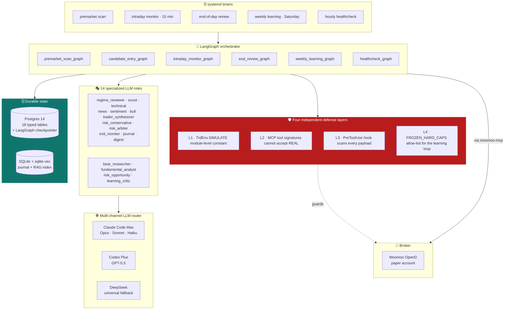
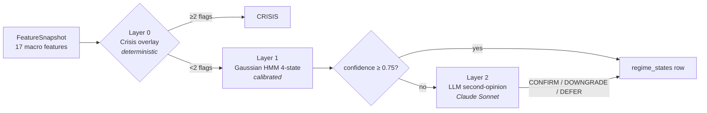

<div align="center">

# `trading-agent`

**An autonomous, multi-agent paper-trading research system**

*built around a single uncomfortable insight:*

> LLMs can reason about markets. <br/>
> Only deterministic code is allowed to take risk.

<br/>


<br/>

[**Why this exists**](#why-this-exists) ·
[**The architecture**](#the-architecture) ·
[**The four pillars**](#the-four-pillars) ·
[**Multi-agent orchestration**](#multi-agent-orchestration) ·
[**Design principles**](#design-principles) ·
[**Quickstart**](#quickstart)

</div>

---

## Why this exists

Most "AI trading agent" projects on GitHub are essentially *one prompt and a market data feed*. They wire an LLM to a broker API, feed it price candles, parse the output into orders, and hope.

This one is the opposite hypothesis.

I wanted to know: *if you actually tried to build a multi-agent LLM system that a careful person would run on real capital — what would the architecture have to look like?* Not as a get-rich tool. As a research vehicle for a much harder question:

> **Where exactly is the line between "LLMs as reasoning agents" and "LLMs as risk-takers"?** <br/>
> And can you draw it sharply enough in code that the LLMs *physically cannot cross it*, no matter what the prompt says?

That question turns out to require almost everything else: regime awareness, portfolio-level risk, online learning, multi-LLM redundancy, durable state, hard guardrails, statistical promotion gates. Each piece is somebody's whole project. Pulling them together — and refusing to compromise on any single safety layer — is what's interesting here.

This repo is the result. Paper-only, by design. Real money is **explicitly not in scope** and is structurally prevented at four independent layers.

---

## What it actually is

A senior-trader-shaped autonomous agent that, end to end:

1. **Reads the market regime** before it considers any name — a 5-state Gaussian HMM with a deterministic crisis overlay, optionally reviewed by an LLM that can *only downgrade or defer, never upgrade*.
2. **Researches a candidate** through four parallel analyst agents (technical, fundamental, news, sentiment), then drives a Bull-vs-Bear debate, then retrieves its own past trades on the same setup from a vector index it built itself.
3. **Writes a thesis with invalidation criteria** *before any order can be constructed* — enforced by a `PreToolUse` hook that returns exit-code 2 if the thesis row is more than 10 minutes stale.
4. **Sizes the position** against six numerical rules (single-trade risk ≤ 2 %, sector correlation gate, options Δ/DTE windows, earnings lockout, …) — re-validated in a separate Python process that has no model context.
5. **Passes through an Active Risk Agent** — portfolio aggregates (correlation matrix, factor exposure, aggregate Greeks, heat to stop) checked against per-regime tiered guardrails. Decision is one of `APPROVE / DOWNSIZE / VETO / DEFER`.
6. **Optionally invokes a 3-step LLM Risk Council** — Conservative reviewer (Claude Sonnet) → Opportunity reviewer (GPT-5.5) → Arbiter (Claude Opus). The council is *cross-family by design*: a flaw in one model's prior is unlikely to be shared by the other two.
7. **Places the paper order** through `moomoo-mcp` → MoomooOpenD.
8. **Captures the fill** and writes the full audit chain — thesis → proposal → debate → risk decision → regime state → params version → broker order — into 18 typed Postgres tables.
9. **Monitors intraday** with per-position exit reasoning (Haiku) and live max-adverse / max-favorable excursion tracking.
10. **Closes the loop**: each closed trade goes back into a vector journal, fuels post-mortems, feeds a learning critic that *proposes bounded parameter mutations*, and those mutations enter a shadow → canary → active pipeline gated by Wilson lower bound, profit factor, and drawdown — with auto-rollback on five consecutive losing days.

Each one of those is a deliberately conservative implementation. The interesting part is what happens when you stack them.

---

## The architecture



> Every subgraph is checkpointed. `kill -9` mid-tick → systemd restart → resume from the last completed node. A boolean flag file (set by an iOS Shortcut over a Cloudflare Tunnel) silently halts every timer instantly.

---

## The four pillars

### 1 · A physical safety floor that the LLMs can never cross

The most important design decision is not architectural — it's **structural**. There must be no path from any LLM output, no matter how exotic, to a real-money order. That means safety can't live in a system prompt; it has to live in code that the LLM can't author.

Four independent layers, each sufficient on its own:

<table>
<tr><th width="20%">Layer</th><th width="35%">Where it lives</th><th>What it physically does</th></tr>

<tr><td><b>L1 · Code constant</b></td>
<td><code>mcp_servers/moomoo/server.py</code></td>
<td>
<code>PAPER_ENV: TrdEnv = TrdEnv.SIMULATE</code> is a module-level constant. Every order path begins with <code>assert PAPER_ENV == TrdEnv.SIMULATE</code>. There is no Python codepath that builds a non-SIMULATE trade context.
</td></tr>

<tr><td><b>L2 · Tool signature</b></td>
<td>FastMCP tool definitions</td>
<td>
<code>place_paper_order</code> and <code>place_paper_option_order</code> <i>do not expose</i> a real-environment parameter at all. FastMCP + Pydantic reject unknown kwargs at the schema layer, before the function is ever called.
</td></tr>

<tr><td><b>L3 · PreToolUse hook</b></td>
<td><code>hooks/reject_real_env.py</code></td>
<td>
Scans every tool-call JSON payload for any real-trading environment or credential markers. Match → exit code 2 → call refused. Runs in a fresh subprocess with no model context to argue with. <i>(This README itself triggered the hook the first time it was written. The hook works.)</i>
</td></tr>

<tr><td><b>L4 · Online-learning allow-list</b></td>
<td><code>learning/params.py</code></td>
<td>
The learning loop can mutate 19 named parameters across 6 families. <code>FROZEN_HARD_CAPS</code> hard-rejects writes to <code>enable_real</code>, the trade-environment toggle, R1/R5 ceilings, <code>size_mult_crisis</code> — any attempt raises <code>FrozenParamMutationAttempt</code>. The agent can <i>improve itself</i> only inside a bounded box.
</td></tr>
</table>

This is the foundation. Everything else assumes it.

### 2 · Hybrid market awareness — math first, LLM second

LLMs are unreliable regime classifiers. They hallucinate labels under noisy macro inputs and they're confidently wrong at exactly the moments you need them most (fast transitions, illiquid prints).

So the regime detector inverts the usual order:



Five labels: `BULL_TREND` · `RANGE_LOW_VOL` · `VOLATILE_TRANSITION` · `BEAR_TREND` · `CRISIS`.

The asymmetry is the point. **The LLM can only loosen the regime call, never tighten the position-sizing posture beyond what the math allowed.** Hard floors in Python silently reject upgrade attempts and emit an ops alert.

### 3 · Asymmetric LLM authority — the council can veto, never approve

The same asymmetry shows up everywhere a model touches a risk decision.

The Active Risk Agent runs portfolio-level checks first (correlation matrix, factor concentration, aggregate Greeks, heat-to-stop) against per-regime tiered guardrails. Decision is one of `APPROVE` / `DOWNSIZE` / `VETO` / `DEFER`. Borderline cases trigger a 3-step LLM council:

| Step | Role | Model | Mandate |
| :-: | --- | --- | --- |
| 1 | Risk Conservative Reviewer | Claude Sonnet | "What can go wrong?" |
| 2 | Risk Opportunity Reviewer | Codex GPT-5.5 | "Is this rejection too mechanical?" |
| 3 | Risk Arbiter | Claude Opus | Final structured decision *(cannot exceed deterministic caps)* |

The council is **cross-family by design**: Conservative is a Claude family member, Opportunity is a GPT family member, Arbiter is back to Claude — but Opus, not Sonnet. A systematic prior failure in one model is unlikely to be shared by all three.

`risk_decisions` rows are append-only with a 30-minute `expires_at`. The executor refuses any decision past expiry. The council's only powers are *VETO*, *DOWNSIZE*, and *DEFER*. It physically cannot widen risk.

### 4 · Bounded online learning — shadow → canary → active

The hardest design challenge in any self-improving system is making sure the improvement loop can't unsafe itself. Solved here by a tightly bounded mutation surface and statistical promotion gates:

```mermaid
flowchart LR
    CTRL[ACTIVE param_version<br/><i>baseline</i>] --> EXEC[Live decision]
    EXEC --> JT[journal_trades<br/>+ params_version_id]
    JT --> EOD[enrich_outcomes]
    EOD --> TOF[(trade_outcome_features)]

    SH[SHADOW param_version] -.replay.-> SHADOW[shadow_track_node]
    SHADOW --> LE[learning_events]

    TOF --> WL[weekly_learning_graph]
    LE --> WL
    WL --> CRITIC[Learning Critic<br/><i>GPT-5.5</i>]
    CRITIC -->|propose| DRAFT[DRAFT param_version]
    DRAFT -->|replay scoring<br/>SR + IR − λ·MDD| GATE{Wilson LB<br/>+ profit factor<br/>+ drawdown ≤ 1.1×?}
    GATE -- yes --> CANARY[CANARY @ 10% traffic]
    GATE -- no --> REJ[REJECTED]
    CANARY -- N≥20 trades --> EVAL{evaluate_canary}
    EVAL -- pass --> PROMOTE[ACTIVE]
    EVAL -- 5-day losing streak --> ROLLBACK[REJECTED + rollback]
```



The mutable surface is **19 named parameters across 6 families** — sizing soft caps, stop distances, entry filters, regime thresholds, candidate count, regime size multipliers. Hard caps and the simulate/real toggle live in `FROZEN_HARD_CAPS` and *cannot* be reached from any `param_versions` row.

The Critic runs once a week (Saturday post-close). Stable-hash bucket assignment routes a small slice of *real paper trades* to canary parameters once the replay gates pass. Auto-rollback on a five-day losing streak. **No promotion is ever the model's call alone** — three statistical gates (Wilson 95% CI lower bound, profit factor, max drawdown) and a minimum sample size of 20 trades stand between a canary and active deployment.

---

## Multi-agent orchestration

Fourteen LLM-using roles, mapped deliberately to model tiers and provider families:

| Role | Channel | Model tier | Why this tier |
|---|---|---|---|
| `trader_synthesizer` | Claude Code | **Opus** | Highest-stakes synthesis — turns the debate + RAG + reports into a typed proposal |
| `risk_arbiter` | Claude Code | **Opus** | Final risk decision under deterministic caps |
| `regime_reviewer` | Claude Code | Sonnet | Confidence-gated second opinion on HMM output |
| `technical_analyst` · `bull_researcher` · `risk_conservative` | Claude Code | Sonnet | Mid-cost reasoning loops |
| `scout` · `news_analyst` · `sentiment_analyst` · `exit_monitor` · `journal` · `digest` | Claude Code | Haiku | High-volume, cheap, near-deterministic |
| `bear_researcher` · `fundamental_analyst` · `risk_opportunity` · `learning_critic` | **Codex Plus** | GPT-5.5 | Cross-family adversarial reasoning |
| *every Codex role* | **DeepSeek** | deepseek-v4-pro | Schema-matched universal fallback when Codex quota is exhausted |

Why subprocess-based routing instead of an SDK? Claude Code Max and Codex Plus are flat-fee subscriptions. An SDK would burn API tokens. `claude -p` and `codex exec` reuse the user's logged-in OAuth credentials via the local CLI — **zero per-call dollar cost**, just subscription quota. A weekly token-budget governor reads from `agent_events` and triggers automatic degrade-to-DeepSeek at 95% of weekly cap.

Every role has a strict typed output contract. **21 Pydantic schemas** in `llm/schemas.py` validate every LLM response. Schema violations are retried with the validation error fed back to the model; persistent failures degrade gracefully to a deterministic fallback rather than ever placing a malformed order.

---

## What makes this different

You'll find a hundred trading-agent repos on GitHub. Most of them ship one of:

| Common shape | What's missing |
|---|---|
| **One LLM, one prompt, one broker.** | No portfolio-level risk; no regime awareness; no audit chain; no separation of reasoning from risk-taking. |
| **A backtester with an LLM in the loop.** | Doesn't survive contact with live order routing; no fault-tolerance; no online adaptation. |
| **A LangChain demo with a market data tool.** | No checkpointing, no halt switch, no sizing math, no journal, no post-mortem feedback. |
| **A "trade ideas generator".** | No execution plumbing, no fills, no closed-loop learning. |

This project's claim is narrower and more precise:

> A faithful, end-to-end, fault-tolerant *autonomous loop* — where every decision the system can make has a deterministic safety floor underneath it, the LLMs operate strictly inside that floor, and the whole thing keeps a forensic audit trail you could hand to a regulator.

It's deliberately built so that the interesting work — the multi-agent reasoning — happens *on top of* a structurally safe substrate, not *as a substitute for* one.

---

## System surface

| | |
|---|---|
| Python | ~18,000 lines, 3.12-only, type-checked |
| LangGraph | 6 compiled subgraphs, Postgres-checkpointed |
| State | 18 Postgres tables (audit, regime, risk, learning, journal) + sqlite-vec journal |
| LLM contracts | 21 typed Pydantic output schemas |
| Specialized agents | 14 LLM-using roles · 36 agent definition files (Claude + Codex variants) |
| Mutable parameters | 19 keys across 6 families · `FROZEN_HARD_CAPS` allow-list |
| Test surface | 210 tests passing · graph compilation, sizing rules, regime gates, risk arbitration, learning math, OAuth router, schema retry |
| Notification fabric | ntfy.sh public tier, 5 topics, iOS Shortcut killswitch via Cloudflare Tunnel |

```text
trading-agent/
├── src/trading_agent/
│   ├── orchestrator.py            cron entry point + halt-flag check
│   ├── halt_endpoint.py           FastAPI /halt + /resume (token-authenticated)
│   ├── graph/
│   │   ├── builder.py             6 compiled subgraphs, Postgres checkpointer
│   │   ├── checkpointer.py        crash-resumable LangGraph state
│   │   └── nodes/                 10 node modules, every node real
│   │       ├── regime_nodes.py    regime detection pipeline
│   │       ├── trade_nodes.py     research → debate → propose → size
│   │       ├── risk_nodes.py      portfolio risk + 3-step council
│   │       ├── intraday_nodes.py  refresh quotes → exit detect → route
│   │       ├── eod_nodes.py       reconcile → mark-to-market → digest
│   │       ├── premarket_nodes.py macro snapshot → rank → push
│   │       ├── eod_learning.py    excursions + outcomes + canary apply
│   │       ├── learning_nodes.py  active params + canary route + shadow
│   │       ├── weekly_learning.py LLM critic → replay → promote-to-canary
│   │       └── health_nodes.py    OpenD + Postgres + ntfy heartbeat
│   ├── regime/                    HMM + crisis overlay + LLM second-opinion + gates
│   ├── risk/                      portfolio aggregates + tiered guardrails + LLM council
│   ├── learning/                  params · shadow · canary · promote · replay · soak
│   ├── llm/                       OAuth subprocess router · 21 Pydantic schemas · weekly budget
│   ├── mcp_servers/{moomoo,edgar,journal}/   stdio MCP servers
│   ├── hooks/                     reject_real_env · pretool_order_guard · posttool_fill_capture
│   └── notify/                    ntfy.sh + Discord mirror + filesystem fallback
├── migrations/                    schema + idempotent re-run
├── deploy/ec2/systemd/            6 systemd units + 5 timers
├── tests/                         210 unit + integration tests
└── data/                          gitignored — sqlite journal + filings cache + halt flag
```

---

## Design principles

These are the rules that produced everything above. They're meant to be opinionated.

> **1 · Asymmetric authority.** Deterministic code has the floor on risk. LLMs may *tighten* but never *loosen* it. Every place a model touches a decision, this asymmetry is enforced in code, not in a prompt.

> **2 · Cross-family redundancy.** Any decision important enough to call an LLM gets called *across model families* (Claude × GPT × DeepSeek). A flaw in one model's prior is unlikely to be shared by all three.

> **3 · The hook is a subprocess, not a string.** A hook returning exit-code 2 is a fact. A prompt instruction is a wish. Every safety check is a hook or a code constant — *never* a polite request to the model.

> **4 · Audit before action.** Every node writes to `agent_events` *before* it acts. If the system crashes mid-decision, the audit trail still tells you what was decided and why.

> **5 · Bounded mutation surface.** Self-improvement is allowed inside an explicit allow-list. Outside it — frozen. The learning loop cannot reach the safety floor.

> **6 · Statistical gates over opinion gates.** Promotion from canary to active is not the LLM's call. Wilson lower bound, profit factor, drawdown — three numbers that don't argue.

> **7 · Crash-resumable everything.** `kill -9` mid-run must be safe. Postgres checkpointer for state, append-only audit, idempotent migrations, halt-flag pre-condition on every timer.

> **8 · No silent degradation.** When something fails — an LLM, a broker, a quote feed — the system *says so* (severity-tagged event + ntfy alert). It never quietly does the wrong thing.

> **9 · Real money is a separate conversation.** The frozen `enable_real` toggle, plus L1–L4, are designed so that graduating to live capital requires *code edits and review*, not a config flip.

---

## Influences

This architecture is a synthesis of ideas from a lot of recent work. If you find any of this interesting, the original sources are better than my distillation:

- **[TradingAgents](https://arxiv.org/abs/2412.20138)** (Tauric) — analyst pod / debate / trader / risk pipeline; the role decomposition borrows heavily from this.
- **[TradingGroup](https://arxiv.org/abs/2508.17565)** — multi-LLM debate dynamics; the cross-family council is in this spirit.
- **[QuantEvolve](https://arxiv.org/abs/2510.18569)** — diversity-archive style population search; the canary-cell archive design draws on it.
- **[R&D-Agent-Quant](https://arxiv.org/abs/2505.15155)** — Critic-loop weekly review structure.
- **[LangGraph](https://langchain-ai.github.io/langgraph/)** persistence + durable-execution docs — the Postgres-checkpointed crash-resume model.
- **QuantBook** L11–L17 (HMM regime modeling, vectorized risk).
- **FinCon**, **QuantAgent**, **Shannon**, **wshobson/agents**, **open-multi-agent** — orchestration patterns.

A more granular module-by-module attribution lives in [`docs/ARCHITECTURE.md`](docs/ARCHITECTURE.md).

---

## Quickstart

> [!IMPORTANT]
> Paper-only. Real-money trading is structurally prevented (see *Pillar 1*). Don't try to "fix" that.

**Prerequisites.** Python 3.12, Postgres 14, Moomoo OpenD (paper account), Claude Code Max + Codex Plus subscriptions (or DeepSeek API key for the universal-fallback channel), a phone with the [ntfy app](https://ntfy.sh/app).

**Phase 1 — manual mode (Mac, Claude Code).**
```bash
git clone https://github.com/zjzJoez/trading-agent.git
cd trading-agent
bash scripts/setup.sh                      # uv sync + .env + launchd templates
$EDITOR .env                               # set SEC_UA_EMAIL (required by SEC)
.venv/bin/python scripts/smoke.py          # 17 PASS / 0 FAIL — validates MCP + hooks + RAG
```
Then in Claude Code: `/research AAPL` · `/size AAPL LONG` · `/enter`. Every step can fail loudly. That's the feature.

**Phase 2 — autonomous mode (Linux box, headless).**
```bash
# Postgres + migrations
sudo apt-get install -y postgresql-14
sudo -u postgres createdb trading_agent
.venv/bin/python -m trading_agent.store.postgres   # idempotent migration runner

# OAuth login (once, persists)
claude login
codex login --device-auth

# Seed the learning baseline
.venv/bin/python -c "from trading_agent.learning.params import seed_baseline_if_absent; print(seed_baseline_if_absent())"

# 5 systemd timers (premarket, intraday, eod, learning, healthcheck)
sudo bash deploy/ec2/systemd/install_timers.sh
```

The full deployment recipe — including the iOS killswitch, Cloudflare Tunnel for the halt endpoint, ntfy topic provisioning, and OpenD service — lives in [`deploy/ec2/systemd/`](deploy/ec2/systemd/).

---

## Tests

```bash
.venv/bin/python -m pytest tests/                   # 210 tests, ≤2 seconds
.venv/bin/python scripts/smoke.py                   # MCP + hook + RAG round-trip
.venv/bin/python scripts/verify_cc_loop.py          # headless Claude Code subprocess
.venv/bin/python scripts/option_paper_dry_run.py    # live paper-options E2E
```

| Suite | Count | Scope |
|---|:-:|---|
| `tests/regime/` | 18 | Feature math · HMM transitions · crisis-overlay precedence · gate matrix |
| `tests/risk/` | 31 | Portfolio aggregates · per-regime guardrails · agent council arbitration |
| `tests/learning/` | 31 | Param bounds · resolver fallback · shadow counterfactuals · composite scoring · canary math |
| `tests/llm/` | 27 | OAuth subprocess invocation · schema retry · weekly budget · degrade path |
| `tests/graph/` | 36 | Subgraph compilation · every Phase 2.5+ node behavioral test |

---

## Disclaimer

> [!WARNING]
> Educational research. **Not investment advice.** Configured for paper trading only. Markets are adversarial, fills slip, your live P&L will not look like your paper P&L, and the model on the other side of your trades is smarter than you think. The author accepts zero liability for any losses, broker disputes, or regulatory consequences resulting from use or misuse of this software.

If you ever decide to take any of these ideas to live capital, **build your own risk framework with real professional review**. The frozen real-money toggles in this repo are deliberate roadblocks; please leave them in place.

---

## License

[MIT](LICENSE).

---

<div align="center">
<sub>
Built one node, one hook, one frozen parameter at a time.<br/>
<b>The interesting question isn't whether an LLM can trade. It's where the line is.</b>
</sub>
</div>
