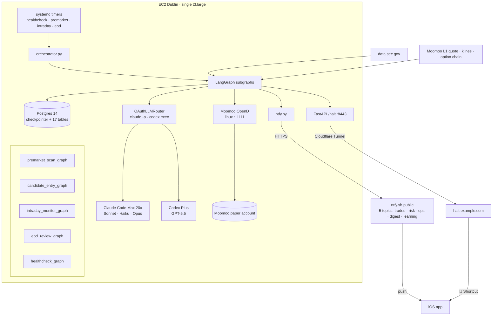
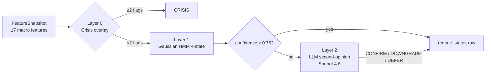
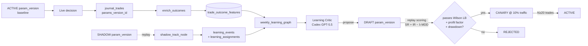

<div align="center">

# `trading-agent`

**A senior-trader-grade, paper-only, self-learning stock & options agent —
Phase 1 ships as a Claude Code MVP, Phase 2 promotes it into a fully autonomous
LangGraph + Postgres + multi-LLM service running unattended on a single EC2 box.**

*一个从「在 Claude Code 里手动调度」一路演化到「单台 EC2 上完全自主运行」的纸面交易代理：
LangGraph 编排、Postgres 状态机、HMM + LLM 双层市场体制识别、组合级主动风控、
影子→灰度→全量在线学习、OAuth 多模型 LLM 路由、ntfy 推送 + iOS 一键 halt。*

<br/>


</div>

---

## TL;DR

| | Phase 1 (MVP) | Phase 2 (Autonomous) |
| --- | --- | --- |
| **Driver** | Human typing slash commands in Claude Code | Cron-driven LangGraph subgraphs on EC2 |
| **State** | SQLite (`trader.db`) | Postgres 14 (17 tables incl. checkpointer) |
| **Broker** | Mac Moomoo OpenD | Linux Moomoo OpenD on EC2 |
| **Risk model** | R1–R6 deterministic + 3-layer real-money defense | + Active Risk Agent (correlation, factor, Greeks, heat) + LLM council |
| **Market awareness** | None | 5-state regime classifier (HMM + crisis overlay + LLM second-opinion) |
| **LLM transport** | Claude Code prompt loop | OAuth subprocess router (Claude Code Max + Codex Plus) — zero per-call $ |
| **Self-improvement** | Weekly post-mortem → embedded RAG lessons | + Online learning loop: shadow → canary → promote with statistical gates |
| **Notifications** | None | ntfy.sh + iOS Shortcut `🛑 /halt` killswitch |
| **Cost** | $0/mo broker + data + embeddings | + ~$60/mo EC2 (everything else still free) |

> [!NOTE]
> **Paper-only by design — both phases.** Three independent layers stop a real-money order from being constructible. Real-money trading is explicitly out of scope (and a Phase 3 conversation, not a Phase 3 commit).

---

## What this is

A trading agent that behaves like a disciplined swing trader, then takes itself off your hands:

1. **Researches** a name before touching it — live quote, option chain, recent 10-Q / 8-K / Form 4 from SEC EDGAR, plus past trades the agent itself took on the same setup (RAG hits against its own journal).
2. **Writes a thesis** — invalidation, timeframe, expected return, max loss — *before* any order. A `PreToolUse` hook **physically blocks** the order tool if no thesis exists within a 10-minute window.
3. **Sizes the position** against six numerical rules (single-trade risk ≤ 2%, correlated-sector gate, earnings lockout, etc.) — re-validated by a separate Python process that has no model context.
4. **Reads the regime** *(Phase 2)* — 5-state HMM classifier with a deterministic crisis overlay decides whether the day is even tradable, and applies a per-regime size multiplier *before* R1–R6 considers anything.
5. **Goes through the Active Risk Agent** *(Phase 2)* — portfolio aggregates (correlation, factor exposure, Greeks, heat to stop) with per-regime tiered guardrails. Decision is `APPROVE / DOWNSIZE / VETO / DEFER`.
6. **Optionally invokes the LLM Risk Council** *(Phase 2)* — Conservative (Sonnet) → Opportunity (GPT-5.5) → Arbiter (Opus). Council can downgrade or veto, never upgrade.
7. **Places the paper order** through `moomoo-mcp` → MoomooOpenD.
8. **Captures the fill** + writes the full audit chain (thesis → proposal → risk decision → regime state → params version → broker order).
9. **Notifies you** *(Phase 2)* via ntfy. iOS Shortcut hits a Cloudflare-tunneled `/halt` endpoint to instantly silence every cron trigger.
10. **Runs a weekly post-mortem** that aggregates closed trades by strategy, extracts 3–8 lessons, and **embeds them into a vector index** for next week's research.
11. **Mutates its own parameters** *(Phase 2.6)* — bounded keys (sizing aggression, regime thresholds, entry filters) get shadow-replayed, then canary-routed if they beat the baseline on Wilson LB + profit factor + drawdown.

---

## The "aha" — how the agent literally cannot place a real order

Three independent layers, each sufficient on its own. **Both phases retain all three.**

<table>
<tr>
<th>Layer</th><th>Where</th><th>What it does</th>
</tr>
<tr>
<td><b>L1 · Code constant</b></td>
<td><code>mcp_servers/moomoo/server.py</code></td>
<td><code>PAPER_ENV: TrdEnv = TrdEnv.SIMULATE</code> is a module-level constant. Every order path starts with <code>assert PAPER_ENV == TrdEnv.SIMULATE</code>. No Python codepath builds a non-SIMULATE trade context.</td>
</tr>
<tr>
<td><b>L2 · Tool signature</b></td>
<td>MCP tool defs</td>
<td><code>place_paper_order</code> and <code>place_paper_option_order</code> <i>do not expose</i> <code>trd_env</code> as a parameter. FastMCP + pydantic reject unknown kwargs.</td>
</tr>
<tr>
<td><b>L3 · PreToolUse hook</b></td>
<td><code>hooks/reject_real_env.py</code></td>
<td>Scans every tool call's JSON payload for <code>trd_env</code>, <code>REAL</code>, <code>trading_password</code>, <code>trd_password</code>, etc. Match → exit code 2 → call refused. Runs in a fresh subprocess with no model context.</td>
</tr>
<tr>
<td><b>L4 · Online-learning allow-list</b><br/><i>(Phase 2)</i></td>
<td><code>learning/params.py</code></td>
<td>Mutable parameters live in a typed allow-list. <code>FROZEN_HARD_CAPS</code> includes <code>enable_real</code>, <code>trd_env</code>, R1/R5 ceilings, <code>size_mult_crisis</code> — any attempt to write them via a <code>param_versions</code> row raises <code>FrozenParamMutationAttempt</code>.</td>
</tr>
</table>

Phase 1 audit: 22/22 pass. Phase 2 OAuth + LLM tests: 27/27. Risk + regime: 49/49. Learning: 31/31.

---

## Architecture — Phase 1 (manual)

```mermaid
flowchart LR
    CC[Claude Code<br/>desktop / CLI] -->|stdio| MCP1[moomoo-mcp]
    CC -->|stdio| MCP2[edgar-mcp]
    CC -->|stdio| MCP3[journal-mcp]
    CC -.hook.->|PreToolUse| H1[reject_real_env]
    CC -.hook.->|PreToolUse| H2[pretool_order_guard<br/>thesis + sizing R1-R6]
    CC -.hook.->|PostToolUse| H3[posttool_fill_capture]

    MCP1 -->|TCP :11111| OD[MoomooOpenD<br/>paper account]
    MCP2 -->|HTTPS 10 req/s| SEC[data.sec.gov]
    MCP3 --> DB[(SQLite<br/>trader.db)]
    H2 --> DB
    H3 --> DB

    DB -->|MiniLM 384-d| VEC[(notes_vec<br/>sqlite-vec virtual table)]
    VEC -.->|semantic recall| CC
```

Mac is the source of truth. Optional Dublin EC2 runs the headless overnight EDGAR scan + premarket brief and `rsync`s its DB back with composite-key `INSERT OR IGNORE` dedup.

## Architecture — Phase 2 (autonomous)



> All five subgraphs are Postgres-checkpointed. `kill -9` mid-run → systemd restart → resume from the last completed node. `data/halt.flag` (set by the iOS Shortcut) is checked by every timer's `ExecCondition` so the killswitch is instant.

---

## Phase 2 core upgrades

### Regime Detection Agent

Three layers, evaluated in order:



Five labels: `BULL_TREND` · `RANGE_LOW_VOL` · `VOLATILE_TRANSITION` · `BEAR_TREND` · `CRISIS`. The LLM can downgrade or defer; **it cannot upgrade.** Hard floors in Python silently reject upgrade attempts and fire an ops alert.

### Active Risk Agent

Portfolio-level checks — correlation matrix, factor exposure, aggregate Greeks, heat-to-stop — against per-regime tiered guardrails. Decision: `APPROVE / DOWNSIZE / VETO / DEFER`. Borderline cases trigger a 3-step LLM council:

| Step | Role | Model | Mandate |
| --- | --- | --- | --- |
| 1 | Risk Conservative Reviewer | Claude Sonnet 4.6 | "What can go wrong?" |
| 2 | Risk Opportunity Reviewer | Codex GPT-5.5 | "Is rejection too mechanical?" |
| 3 | Risk Arbiter | Claude Opus 4.7 | Final structured decision (cannot exceed deterministic caps) |

`risk_decisions` rows are append-only with a 30-min `expires_at`; the executor refuses any decision past expiry.

### Online Learning Loop *(Phase 2.6)*



Mutable surface (19 keys, 6 families): sizing soft caps, stop distances, entry filters, regime thresholds, candidate count, regime size multipliers — all bounded. Hard risk caps + the simulate/real toggle are in `FROZEN_HARD_CAPS` and *cannot* be reached from any `param_versions` row.

### OAuth LLM Router

Subprocess wrapper around `claude -p` (Claude Code Max 20x) and `codex exec` (Codex Plus). 16 LLM-using roles map to channels (Sonnet 4.6 / Haiku 4.5 / Opus 4.7 / GPT-5.5) with auto-detection of OAuth credentials and a `StubLLMRouter` fallback when creds are absent. Weekly budget governor reads `agent_events` and triggers degrade-to-Sonnet at 95% of weekly cap.

### Halt killswitch

```
iOS Shortcut "🛑 Halt" → POST https://halt.example.com/halt
                               (Cloudflare Tunnel)
                            → FastAPI :8443/halt (HALT_TOKEN bearer)
                            → touch data/halt.flag
                            ↓
   every systemd timer's ExecCondition test ! -f data/halt.flag → silent skip
```

Resume hits the same endpoint with `/resume`, which `rm -f`s the flag.

---

## The full module map

```
trading-agent/
├── pyproject.toml                                 uv-managed, single venv
├── .env.example                                   Phase 1 template
├── .env.opend.example                             Phase 2 OpenD credentials template (gitignored real)
├── migrations/
│   └── 002_phase2.sql                             17 Postgres tables (Phase 2)
├── .claude/
│   ├── agents/                                    12 Claude agent definitions (Phase 2)
│   ├── commands/*.md                              6 manual slash commands (Phase 1, kept for human override)
│   └── skills/                                    9 skills: 6 Phase-1 + regime-detection / portfolio-risk / online-learning
├── .codex/
│   └── agents/                                    4 Codex agent definitions (fundamental / bear / risk-opportunity / learning-critic)
├── src/trading_agent/
│   ├── config.py                                  pydantic env-driven config
│   ├── db.py                                      SQLite + sqlite_vec.load() (Phase 1)
│   ├── store/postgres.py                          psycopg pool + migrations runner (Phase 2)
│   ├── events.py                                  agent_events writer (Phase 2)
│   ├── schema.sql                                 Phase-1 SQLite schema
│   ├── sizing.py                                  R1–R6 — used by /size, the hook, AND the resolver
│   ├── orchestrator.py                            cron entrypoint + halt-flag check
│   ├── halt_endpoint.py                           FastAPI /halt + /resume
│   ├── notify/ntfy.py                             ntfy.sh notifier with RFC 2047 base64 fallback
│   ├── mcp_servers/{moomoo,edgar,journal}/        Phase 1 MCP servers (still reused as modules in Phase 2)
│   ├── hooks/                                     reject_real_env · pretool_order_guard · posttool_fill_capture
│   ├── jobs/                                      Phase 1 launchd / cron jobs
│   ├── regime/                                    Phase 2.2: features · classifier · gates · llm_review · persist
│   ├── risk/                                      Phase 2.3: portfolio · guardrails · llm · agent · persist
│   ├── learning/                                  Phase 2.6: params · shadow · outcome · replay
│   ├── llm/                                       Phase 2.4: oauth_router · roles · budget · schemas (16 Pydantic models)
│   └── graph/
│       ├── state.py                               TradingGraphState TypedDict
│       ├── builder.py                             5 compiled subgraphs
│       ├── checkpointer.py                        Postgres saver
│       └── nodes/                                 stubs · trade_nodes · regime_nodes · risk_nodes · learning_nodes · eod_learning
├── deploy/
│   ├── README_EC2.md                              Phase 1 EC2 recipe
│   ├── ec2/systemd/                               Phase 2 systemd units + 4 timers + install_timers.sh
│   └── launchd/*.plist.template                   Phase 1 Mac cron templates
├── scripts/
│   ├── setup.sh                                   post-clone bootstrap
│   ├── smoke.py                                   one-command MCP + hook smoke test
│   ├── verify_cc_loop.py                          headless `claude -p` tool-loop check
│   ├── option_paper_dry_run.py                    live paper-options E2E
│   └── status.py                                  at-a-glance dashboard
├── tests/                                         pytest — regime · risk · learning · graph · llm
└── data/
    ├── sectors.csv                                static GICS lookup (checked in)
    ├── trader.db                                  SQLite — gitignored
    ├── filings_cache/                             SEC response cache — gitignored
    └── halt.flag                                  iOS killswitch — gitignored
```

---

## The three MCP servers

| Server | Wraps | Exports |
|---|---|---|
| `moomoo-mcp` | `moomoo-api` (Moomoo OpenD) | `get_quote`, `get_option_chain`, `list_option_expiries`, `get_option_chain_snapshot`, `get_historical_kline`, `get_account_info`, `get_positions`, `place_paper_order`, `place_paper_option_order`, `cancel_paper_order`, `get_orders` |
| `edgar-mcp` | `data.sec.gov` | `search_filings`, `get_filing_text`, `get_recent_filings_for_ticker`, `get_insider_transactions` (Form 4), `get_institutional_holdings` (13F-HR) — with ticker→CIK cache, 10 req/s semaphore, 0.12 s post-delay, disk cache under `data/filings_cache/` |
| `journal-mcp` | self (SQLite + sqlite-vec) | `record_thesis`, `record_fill`, `record_virtual_fill`, `append_note`, `close_thesis`, `close_trade`, `search_past_trades` (semantic + lexical), `search_notes`, `list_open_theses`, `get_open_positions_with_thesis`, `generate_post_mortem_prompt` |

Phase 2 reuses these as Python modules from inside the LangGraph nodes — same code paths Phase 1 exercises from Claude Code, no broker re-wiring needed.

## Slash commands (Phase 1 manual mode)

```
/scan                              market scan — SPY/QQQ/VIX + watchlist
/research <TICKER>                 deep dive: quote, chain, filings, Form 4, past-lesson RAG
/size <TICKER> <DIRECTION>         confirms position against R1–R6, outputs qty/stop/target
/enter                             chains thesis → size → place_paper_order; any step fails, whole flow aborts
/eod-review                        open positions vs theses, flags invalidated ones
/weekly-post-mortem                aggregates 7-day closed trades, produces embedded lessons
```

Each command lives under [`.claude/commands/`](.claude/commands) as a `.md` file — readable, editable, not a black box. **Kept around in Phase 2** for manual override sessions when you want to drive a single trade by hand.

## Position-sizing rules (enforced by hook, not by vibes)

The PreToolUse order-guard re-runs [`sizing.py`](src/trading_agent/sizing.py) in a separate process against the proposed order. Violate any rule → exit 2 → order blocked.

| # | Rule |
|---|---|
| R1 | Single-trade risk ≤ 2% of account equity. Stock: <code>\|entry − stop\| × qty</code>. Long option: `debit × contracts × 100`. |
| R2 | ≤ 5 concurrent open positions. |
| R3 | Single-name combined stock + option notional exposure ≤ 10% of equity. |
| R4 | Same-sector correlation gate — if two same-GICS-sector positions already open, new same-sector denied. Sector lookup via [`data/sectors.csv`](data/sectors.csv). |
| R5 | Options: long premium only. DTE ∈ [14, 60]. Delta ∈ [0.30, 0.55]. Single-leg from `/enter`. ≤ 1% of equity per option trade. |
| R6 | Earnings lockout — within 2 trading days of earnings, only `strategy_label` prefixed `earnings_*` is allowed. |

Phase 2 layers a regime-aware size multiplier *before* R1–R6, never weakens the floor. The Active Risk Agent can DOWNSIZE further but cannot APPROVE past the deterministic cap.

---

## Quickstart — Phase 1 (Mac, paper-manual)

> [!IMPORTANT]
> Mac required for live paper trading (Moomoo OpenD is Mac/Windows/Linux GUI; this section targets Mac). Python 3.12. Claude Code desktop or CLI.

```bash
# 1. Clone
git clone https://github.com/zjzJoez/trading-agent.git
cd trading-agent

# 2. One-command post-clone setup
#    - uv sync (creates .venv + wires the MCP entry points)
#    - generates .env from .env.example
#    - generates .claude/settings.json from .claude/settings.json.example with your absolute project path
#    - generates launchd .plist files from templates (macOS only)
bash scripts/setup.sh

# 3. Fill in .env (you MUST set a real SEC_UA_EMAIL — SEC requires it)
$EDITOR .env

# 4. Install + log into MoomooOpenD paper account
#    https://www.moomoo.com/download/OpenAPI (default port 11111)

# 5. Open this directory in Claude Code
#    Desktop: File > Open Folder > /path/to/trading-agent
#    CLI: cd /path/to/trading-agent && claude

# 6. Sanity check
.venv/bin/python scripts/smoke.py        # 17/17 PASS expected, ~25s
.venv/bin/python scripts/status.py       # dashboard: launchd jobs, DB inventory, hook audit
```

Then in Claude Code:

```
/research AAPL
/size AAPL LONG
/enter
```

Any of those three can fail loudly and stop the flow — that's the feature.

## Quickstart — Phase 2 (EC2, autonomous)

> [!IMPORTANT]
> Single Ubuntu 22.04+ box (target: t3.large, 8 GB RAM, 50 GB EBS). Postgres 14 local. Moomoo Linux OpenD runs on the same box. Claude Code Max + Codex Plus subscriptions for the OAuth router (no API keys needed).

```bash
# On EC2, as ubuntu:
git clone https://github.com/zjzJoez/trading-agent.git ~/trading-agent
cd ~/trading-agent
python3.12 -m venv .venv && .venv/bin/pip install -e .

# Postgres
sudo apt-get install -y postgresql-14
sudo -u postgres createdb trading_agent
echo "DATABASE_URL=postgresql:///trading_agent?host=/var/run/postgresql" > ~/.env.postgres
chmod 600 ~/.env.postgres
.venv/bin/python -m trading_agent.store.postgres   # runs migrations/002_phase2.sql

# Moomoo OpenD on Linux
cp .env.opend.example .env.opend && $EDITOR .env.opend && chmod 600 .env.opend
sudo cp deploy/ec2/systemd/trading-agent-opend.service /etc/systemd/system/
sudo systemctl enable --now trading-agent-opend

# Halt endpoint + Cloudflare tunnel
sudo cp deploy/ec2/systemd/trading-agent-halt.service /etc/systemd/system/
sudo systemctl enable --now trading-agent-halt
# Then point a Cloudflare Tunnel at http://localhost:8443

# OAuth login — done once, persists
claude login
codex login --device-auth

# Seed the Phase 2.6 baseline param_version
.venv/bin/python -c "from trading_agent.learning.params import seed_baseline_if_absent; print(seed_baseline_if_absent())"

# Cron timers (4 of them — healthcheck hourly, premarket Mon–Fri 12:30 UTC, intraday every 15 min, eod 21:30 UTC)
sudo bash deploy/ec2/systemd/install_timers.sh

# Verify
systemctl is-active trading-agent-opend trading-agent-halt postgresql
systemctl list-timers 'trading-agent-*'
.venv/bin/python -c "from trading_agent.llm import get_router; print(get_router().__class__.__name__)"
# → OAuthLLMRouter
```

That's it. The box now runs the full autonomous loop unattended; you only see ntfy notifications on your phone.

---

## Testing & audit

```bash
.venv/bin/python -m pytest tests/                # full suite — regime + risk + learning + llm + graph
.venv/bin/python scripts/smoke.py                # Phase 1 — MCP tools + hooks + RAG round-trip (17/17)
.venv/bin/python scripts/verify_cc_loop.py       # Phase 1 — fresh `claude -p` subprocess tool loop
.venv/bin/python scripts/option_paper_dry_run.py # live paper-options E2E
.venv/bin/python scripts/status.py               # live dashboard
```

| Suite | Count | Scope |
| --- | :-: | --- |
| `tests/regime/` | 18 | Feature math · HMM mapping · crisis-overlay precedence · gate matrix |
| `tests/risk/` | 31 | Portfolio aggregates · per-regime guardrails · agent council arbitration |
| `tests/learning/` | 31 | Param bounds clamping · resolver fallback · shadow counterfactuals · outcome math · composite scoring |
| `tests/llm/` | 27 | OAuth subprocess invocation · schema retry · budget governor · degrade path |
| `tests/graph/` | 4 | Subgraph construction · Postgres checkpoint resume |
| Phase 1 audit (`smoke.py`) | 17 | MCP stdio · hooks · sqlite-vec round-trip |

## Acceptance signal

> 30 consecutive US trading days where you never open a Claude Code session, ntfy reports every decision, no duplicate orders, no missed fills, no unnotified critical event, paper account closes the period with a defensible Sharpe vs SPY.

Phase 2.0a → 2.6 are complete. Phase 2.7 (canary/promote) and Phase 2.8 (30-day soak) are the remaining gates.

---

## Roadmap

### Phase 1 — MVP ✅
- [x] 3 MCP servers (moomoo, edgar, journal)
- [x] 3-layer defense against real-money orders
- [x] PreToolUse thesis + sizing gate
- [x] PostToolUse fill capture
- [x] sqlite-vec + MiniLM RAG over past theses / lessons
- [x] 6 slash commands, 6 skills
- [x] Mac launchd automation (overnight scan, premarket brief, embedding backfill)
- [x] EC2 cron jobs + `db_sync.py` with idempotent merge
- [x] Paper option order E2E proven (SPY 710C)
- [x] 22/22 audit pass (hook bypass, real-env, rate-limit, parser)

### Phase 2.0 — Foundation ✅
- [x] EC2 t3.large + 50 GB EBS + EIP
- [x] Linux Moomoo OpenD on EC2; phone-format login bug fixed
- [x] Postgres 14 + 17-table migration
- [x] ntfy.py + halt_endpoint + Cloudflare Tunnel + iOS Shortcut

### Phase 2.1 — LangGraph skeleton ✅
- [x] 5 compiled subgraphs with Postgres checkpointer + thread IDs

### Phase 2.2 — Regime Detection Agent ✅
- [x] Crisis overlay + Gaussian HMM + LLM second-opinion + tables + 18/18 unit tests

### Phase 2.3 — Active Risk Agent ✅
- [x] Portfolio aggregates + per-regime tiered guardrails + 3-step LLM council + 31/31 unit tests

### Phase 2.4 — LLM wiring ✅
- [x] OAuth subprocess router (Claude + Codex) · 16 Pydantic schemas · 14 agent definition files · weekly budget governor · degrade table

### Phase 2.5 — Autonomous loop ✅
- [x] candidate_entry submits paper orders unattended · intraday monitor closes/reduces · ntfy routing live · 2 real autonomous paper option orders placed end-to-end with full audit chain

### Phase 2.6 — Shadow learning ✅
- [x] 19 mutable params across 6 families · `FROZEN_HARD_CAPS` allow-list · per-graph-run resolver · shadow counterfactual recorder · outcome enrichment · replay with composite SR + IR − λ·MDD scoring

### Phase 2.7 — Canary / promotion *(next)*
- [ ] Stable-hash canary @ 10% → 20% · Wilson LB + profit factor + drawdown gates · auto-rollback on 5 consecutive losing days

### Phase 2.8 — 30-day soak
- [ ] 5 d read-only · 5 d tiny-paper · 20 d canary-disabled · 20 d canary-10% · 30 d full autonomous

### Phase 3 — *not in this repo*
Real money is a separate conversation; this repo will not silently grow that capability. The frozen `enable_real` / `trd_env` keys + L1–L4 defenses are designed to make graduating require code edits + review, not a config flip.

---

## Design notes worth reading

- **Why "thesis before order" as a hook, not a prompt instruction?** Because the prompt instruction can be argued with. The hook is a subprocess that returns exit 2 and the model gets back a blocked-call signal. There is no natural-language path through.
- **Why Postgres in Phase 2 when SQLite worked in Phase 1?** LangGraph's Postgres checkpointer is concurrent-safe and crash-recoverable; SQLite's checkpointer doesn't survive a `kill -9` mid-write on a hot machine. Postgres also gives us first-class jsonb for the 17 audit tables.
- **Why subprocess-based LLM router instead of an SDK?** Claude Code Max + Codex Plus are flat-fee subscriptions; an SDK would burn API tokens. `claude -p` and `codex exec` reuse the user's logged-in OAuth credentials via the local CLI — zero per-call dollar cost, just subscription quota.
- **Why HMM + crisis overlay instead of LLM-as-classifier?** LLMs hallucinate regime labels under noisy macro inputs. The HMM is calibrated and the crisis overlay is deterministic — we use the LLM only as a *second-opinion downgrader*, never as the primary classifier.
- **Why is the LLM council allowed to veto but not approve?** Asymmetric authority: Python deterministic caps are the floor on *risk taken*. The LLM can tighten (downgrade, defer, veto); allowing it to loosen would create a path through the safety floor that depends on prompt engineering.
- **Why MiniLM 384-d instead of something bigger for the RAG journal?** It runs on CPU in ~40 ms per note — no GPU tax, no external API on the critical path. Recall quality is fine for a personal trade journal (validated in `smoke.py`).
- **Why ntfy.sh public tier?** Free, fast (~30 s typical iOS delivery), no account required. Topic prefix is a 64-bit random string so the topic name is the auth. Critical paths also write to filesystem log + Discord mirror so no single channel is load-bearing.
- **Why ship `settings.json.example` and gitignore the real one?** MCP server `command` fields in Claude Code don't reliably expand `${CLAUDE_PROJECT_DIR}`. `scripts/setup.sh` does the substitution at clone time — one command, no manual editing.

## Disclaimer

> [!WARNING]
> This is an educational research project. It is configured for **paper trading only**, and it goes out of its way (see the L1–L4 defense above) to make real trading impossible without removing code on purpose.
>
> Nothing in this repo is investment advice. Markets are adversarial. Your paper P&L is not your live P&L. Slippage, fills, halts, taxes, borrow costs, and your own emotional state on the day of the trade are all missing from a paper environment.
>
> If you ever graduate to real capital, build your own risk framework with real professional review. The author accepts zero liability for any losses, broker disputes, or regulatory consequences resulting from use or misuse of this software.

## Sources synthesized

The Phase 2 architecture is a synthesis of QuantBook L11–L17, TradingAgents (Tauric), TradingGroup (arxiv 2508.17565), QuantEvolve (arxiv 2510.18569), R&D-Agent-Quant (arxiv 2505.15155), QuantAgent, FinCon, wshobson/agents, Shannon, open-multi-agent, and the LangGraph persistence + durable-execution docs. See [`docs/ARCHITECTURE.md`](docs/ARCHITECTURE.md) for module-by-module details.

## License

[MIT](LICENSE).

---

<div align="center">
<sub>Phase 1: built one skill, one hook, one <code>INSERT OR IGNORE</code> at a time.<br/>
Phase 2: orchestrated one LangGraph node, one regime, one bounded parameter at a time. <b>Paper-only, by design.</b></sub>
</div>
